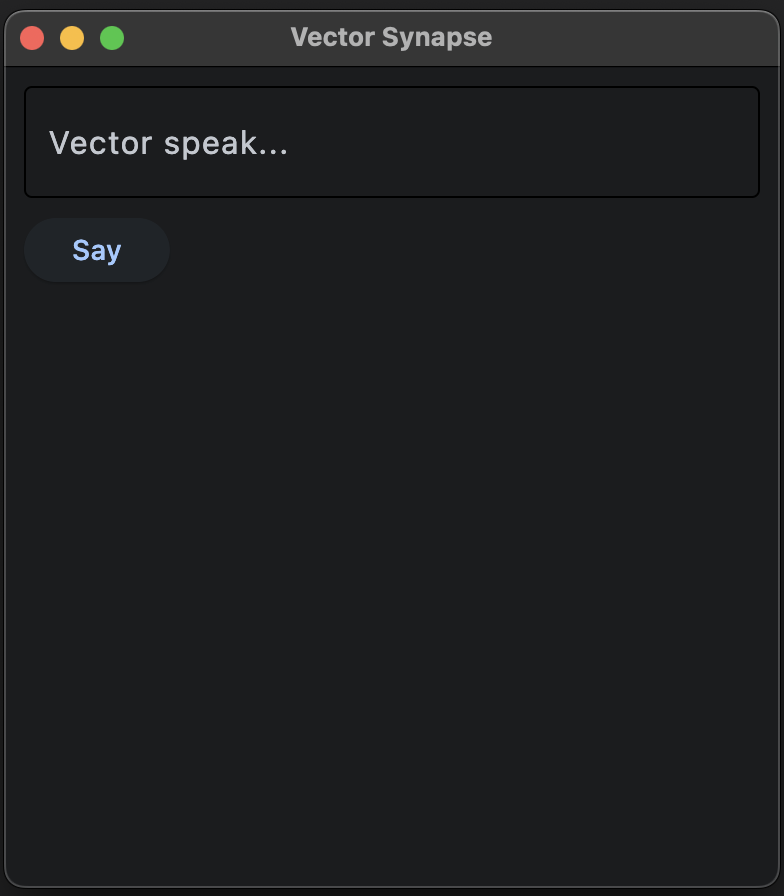
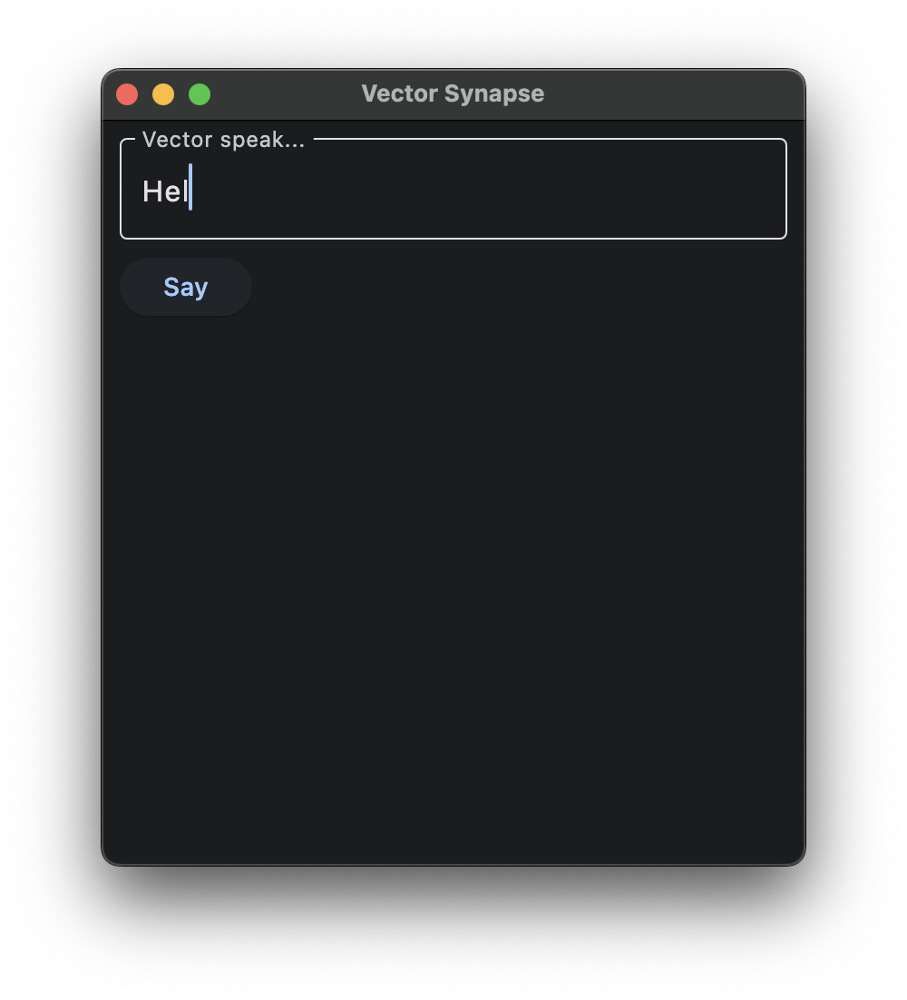
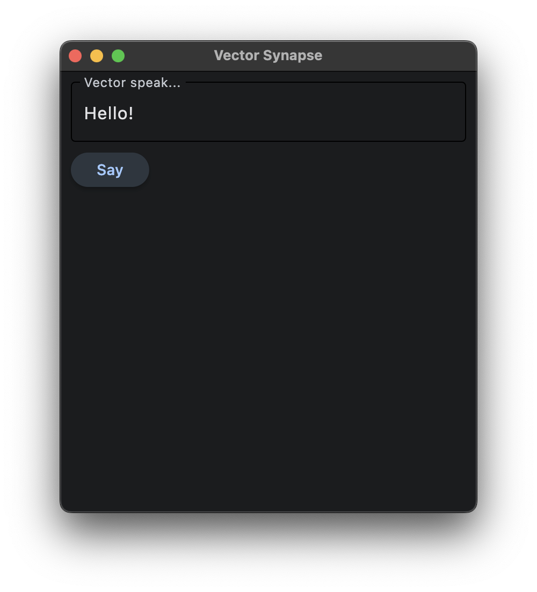
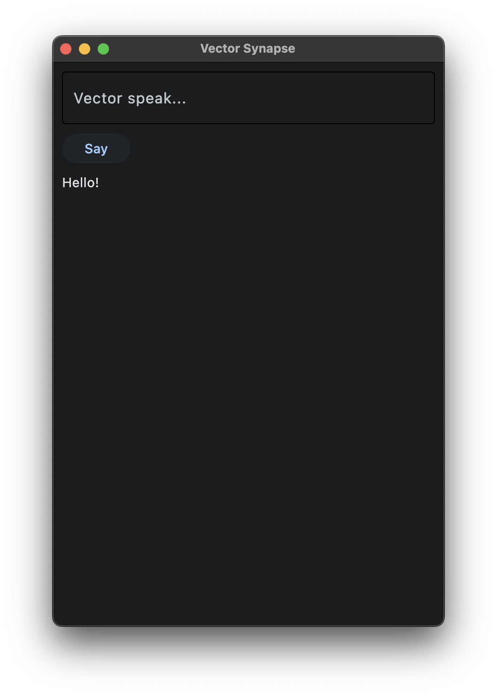

# VectorSynapse Flet App

A simple Flet app for controlling Vector robots.

<!--     -->



## Overview

This app allows users to send text commands to their Vector robot using the Anki Robot SDK/API.

## Getting Started

To run the app, simply execute:

```sh
flet run .
```

## Roadmap/Plans

We plan to enhance this app with the following features:

* [ ] Configuration Editor: allow users to input their serial number and other settings without having to edit the code
* [ ] Support for multiple robots
* [ ] Remote control
* [ ] Camera feed
* [ ] Sensor feeds
* [ ] Status Indicators
* [ ] Styling!
* [ ] Android APK

## Requirements

* Wirepod setup: <https://github.com/kercre123/wire-pod>
* a Vector robot that is compatible and setup on Wirepod

My bot's serial number is hardcoded in `./src/vector_talk.py` — update this variable with your Vector's esn value.

### Credits

Special thanks to...
